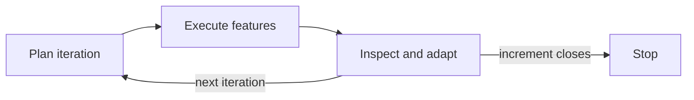

# Shared Context Log — diagram-loop

> Feature workers: read this before starting. Append your section when done.
> Captures patterns established, gotchas discovered, and decisions made.

## Known before starting (from planning)

- Mermaid renders natively in Slidev 52.19.0. Verified on a throwaway deck before this
  iteration was planned. No imports or plugins needed.
- A Mermaid parse error does not fail the build. Check the rendered output, not just the
  exit code.
- You own ONE file. Do not edit any other page file, `slides/slides.md`, or
  `slides/package.json`.
- Iteration 01.3 owns all styling. No colour, no `v-clicks`, no layouts, no theme.

---

## B — Loop diagram (slide 10, `slides/pages/03-commands.md`) — done

**Graph direction:** `graph LR`

**Node count:** 4 (cap is 8)

**Node ids and exact labels:**

| id | label | words |
|----|-------|-------|
| `P` | `Plan iteration` | 2 |
| `E` | `Execute features` | 2 |
| `R` | `Inspect and adapt` | 3 |
| `S` | `Stop` | 1 |

**Edges (2 unlabelled, 2 labelled):**

- `P --> E` (unlabelled)
- `E --> R` (unlabelled)
- `R -- next iteration --> P` — the back-edge
- `R -- increment closes --> S` — the exit edge

**Shape:** a left-to-right chain `Plan → Execute → Inspect and adapt`, with the back-edge
returning under the chain to `Plan` and the exit edge continuing right to `Stop`. Chosen
over a circle per the brief — the return arrow is legible as a return, and the two
labelled edges out of `Inspect and adapt` read as the loop's decision point.

**Terminology used, for cross-diagram consistency checks:** "iteration", "features",
"increment". Verbs are plain (`Plan`, `Execute`, `Inspect and adapt`), not command names
— slide 11 owns the command names, so the diagram deliberately does not repeat them.
"Inspect and adapt" is spelled out, matching the deck's slide 8 title and slide 10's
existing bullet wording. Never abbreviated to "I&A" inside a diagram.

**Style compliance:** no `style`, no `classDef`, no colour, no `v-clicks`, no `layout:`.
Node box colour in the screenshot is the stock Slidev/Mermaid default, not set by us.

**Removed:** the `DIAGRAM-PLACEHOLDER` comment, the `The loop:` line, and the
`plan → execute → inspect and adapt → next iteration → close` bullet. The slide's `##`
heading and its four bullets are untouched, as are slides 9, 11 and 12.

**Verification:**

- `npm run slides` → `slides: 19`, exit 0.
- Built to a private out-dir (shared `dist` was in use by parallel workers):
  `npx slidev build slides.md --out <scratchpad>/build-loop` → exit 0.
- **Proved the diagram actually rendered, not an error box.** Two gotchas found:
  1. *Grepping the built bundle for node labels does not work.* Slidev passes the
     Mermaid source to the `Mermaid` component as a **lz-string-compressed** `code-lz`
     prop, so the plaintext labels are absent from `dist`. Decode instead:
     `require('lz-string').decompressFromBase64(<the code-lz value>)`. That round-tripped
     to the exact source below.
  2. *`mermaid.parse()` in bare Node fails with `DOMPurify.addHook is not a function`* —
     it needs a DOM. Not a syntax error; do not read it as one.
  So the real check was a headless render: served `build-loop` on a local static server
  and loaded slide 10 with `playwright-chromium` (already in `slides/node_modules`;
  import it by absolute path from a scratchpad script). Asserted the rendered SVG's text
  nodes and that no error box was present. Result:
  `["next iteration","increment closes","Plan iteration","Execute features","Inspect and adapt","Stop"]`,
  `MERMAID_ERROR_BOX=false`. All 4 node labels plus both edge labels are in the live SVG.
- **Note for later features:** the chrome-devtools MCP browser is single-instance and was
  already held by a parallel worker. Headless `playwright-chromium` sidesteps that and
  can run concurrently. Also, the scratchpad dir is *shared* across parallel workers — a
  sibling overwrote my `verify.mjs` mid-run. Use a per-feature filename.

**Final Mermaid block as it stands on slide 10:**

````

````

---
