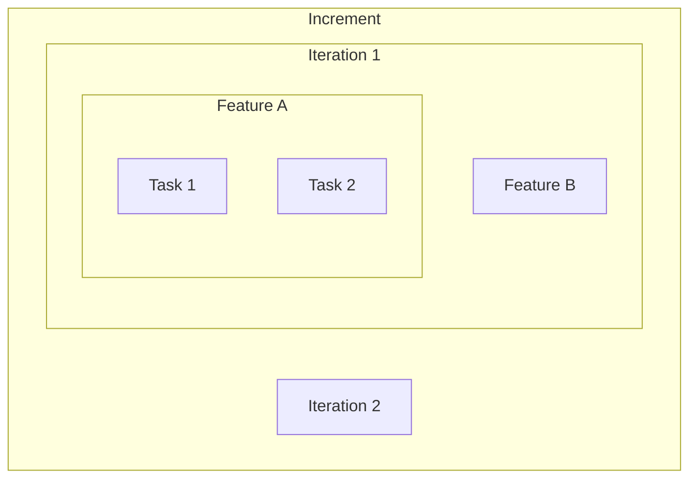

## The hierarchy

---

## Increment

- A major scope of work, named up front.
- Example: "Document management + audit export".
- Contains several iterations, each planned when its turn comes.
- Scope never shrinks. Only you can cut it.
- `/devmeta:go` drives one increment, then stops and waits.
- Its end is your decision point: what next?

---

## Iteration

- A deliverable slice inside an increment.
- Produces exactly one PR, merged before anything else starts.
- Commit per task, PR per iteration.
- Nothing closes with failing tests.
- Always followed by an I&A cycle. Structural, not optional.

---

## Feature

- The unit of parallel execution, and the unit of context.
- One subagent runs one feature, start to finish.
- Tasks inside a feature are sequential steps, not parallel workers.
- Features that share no files run at the same time.
- Planning's real job: find boundaries that maximize independence.
- `tk`, the tracker holding this structure, calls a feature an epic.

---

## The I&A cycle

- Inspect & Adapt. Runs after every iteration, on the base branch.
- Code review, docs audit, gap check against scope.
- Reassesses the plan for the iterations still ahead.
- Writes learnings to `.devmeta/lessons-learned.md` and `.devmeta/project-history.md`.
- Its last task is real work: planning iteration N+1.
- The payoff: iteration N+1 is easier than iteration N.
