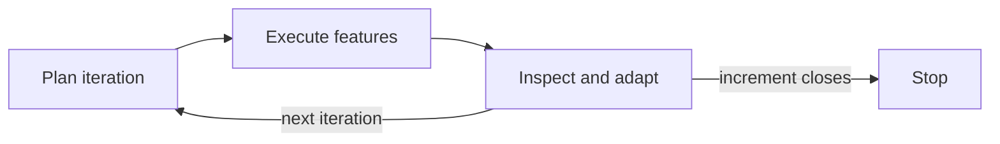

## The three you run

<v-clicks>

- `/devmeta:discuss-project` — optional. Use when the shape is still unclear.
- It writes a thinking doc to `docs/thoughts/`, then hands off.
- `/devmeta:start-increment-spec` — define one increment through an interactive scope dialogue.
- `/devmeta:go` — the autonomous driver. Takes that increment to completion.
- In day-to-day use, that is the whole surface.

</v-clicks>

---

## What `/devmeta:go` does

- Reads tick state, decides the next action itself, acts.
- Never asks whether to continue. Iteration boundaries are waypoints, not stops.
- Stops on a genuine external blocker, or when the increment closes.
- Interrupted? Run it again — it resumes from tick state, no setup.

---

## The four it calls for you

<v-clicks>

- `/devmeta:plan-iteration N` — split an iteration into features and tasks.
- `/devmeta:run` — execute features, one subagent each, parallel across waves.
- `/devmeta:reflect N` — the I&A cycle: code review, docs audit, plan reassessment.
- `/devmeta:status` — read-only progress check, safe to run any time.
- `/devmeta:go` never invokes `/devmeta:status`. It sits outside the loop.

</v-clicks>

---

## Do not call them yourself

<v-clicks>

- `/devmeta:plan-iteration`, `/devmeta:run` and `/devmeta:reflect` are orchestration primitives.
- Calling one directly pre-empts `/devmeta:go` and breaks the autonomous loop.
- You then stitch iteration boundaries together by hand.
- The exception is debugging — run them manually only then.
- `/devmeta:status` is always safe: read-only, never part of the loop.

</v-clicks>
