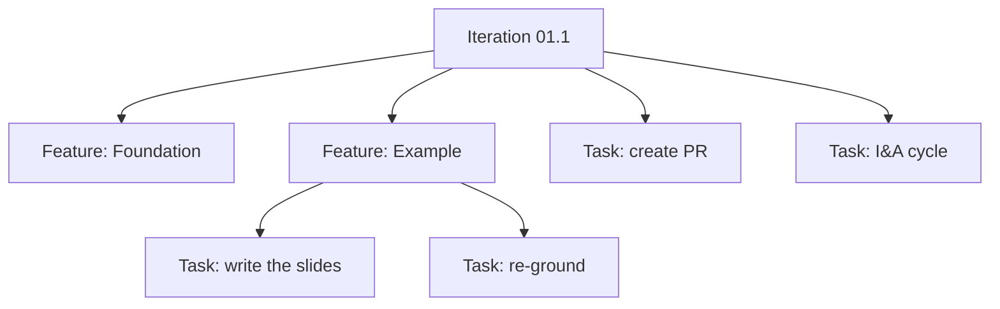

## Step 1 — define the scope

```bash
/devmeta:start-increment-spec "Slidev deck explaining how DevMeta works"
```

- It interviews you: goal, deliverables, exclusions, iteration split, exit criteria.
- You cut PDF export, hosting, and speaker notes — recorded as excluded.
- Three iterations agreed: content spine, diagrams, then theme and motion.
- Exit criteria go into `_overview.md`: build exits 0, 15-20 slides.
- This deck is that increment. Every artifact is in this repo.

---

## Step 2 — `/devmeta:go` plans

- You run `/devmeta:go` once. Nothing else is typed after this.
- It cuts the base branch, checks the environment, then plans iteration 01.1.
- Features get cut so no two of them touch one file.



---

## Step 3 — features run

<v-clicks>

- Foundation goes first, alone. It splits the deck into six files.
- Then five features run at once, one subagent each.
- Every subagent owns one file. This slide came from `pages/04-example.md`.
- Tasks inside a feature run in order: commit and tests per task.
- Features hand off through `context-log.md`, never through the orchestrator.
- Coherence runs last and alone. One PR for the whole iteration.

</v-clicks>

---

## Step 4 — merge, reflect, repeat

<v-clicks>

- The PR merges into the base branch before anything else happens.
- The I&A cycle reviews the code, audits docs, reassesses the plan.
- This iteration's lesson: split the artifact before splitting the work.
- Its last task is real work: planning iteration 01.2, the diagrams.
- No handoff gap, so `/devmeta:go` rolls straight into the next iteration.
- When 01.3 closes, the increment closes and `/devmeta:go` hands back.

</v-clicks>
