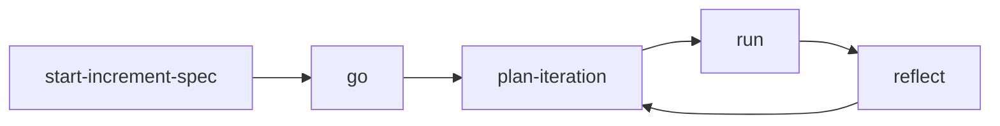

# How DevMeta Works

Scaffold deck — proves the toolchain runs

<div class="pt-12 text-sm opacity-70">
Press <kbd>space</kbd> for the next slide
</div>

---

## Slide syntax

Three dashes start a new slide. The rest is plain Markdown.

- Bullet lists work
- `inline code` works
- **bold** and *italic* work

---

## Reveal one item at a time

<v-clicks>

- First click shows this
- Second click shows this
- Third click shows this

</v-clicks>

---

## Code with line highlights

```ts {2|3|all}
const increment = defineIncrement({
  iterations: 3,
  features: ['spec', 'plan', 'run'],
})
```

---
layout: two-cols
---

## Two columns

Left side content.

::right::

## Right

Right side content.

---

## Diagrams



---
layout: center
class: text-center
---

# Replace this deck

Run `/devmeta:start-increment-spec` to build the real one
